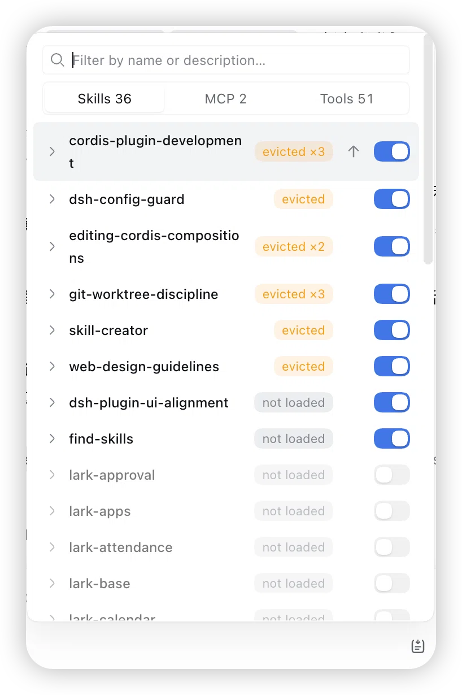
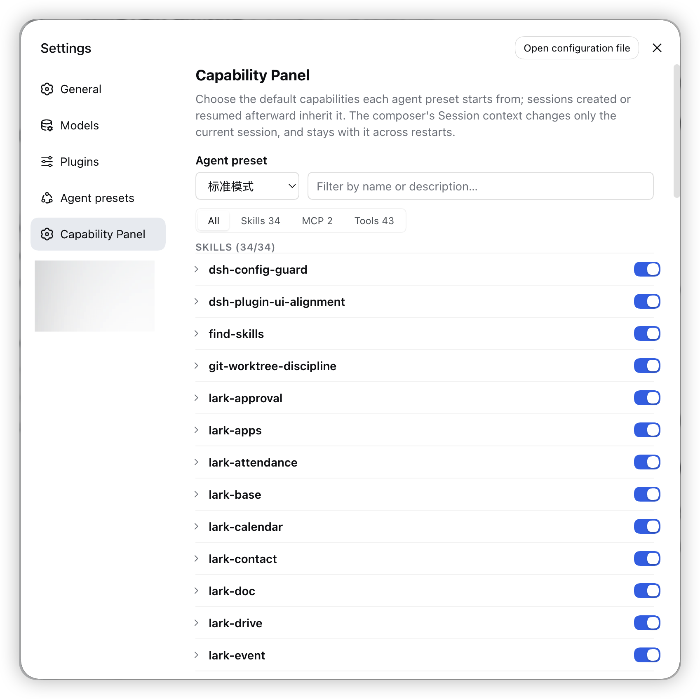

# dsh-capability-panel

[English](README.md) | [中文](README.zh.md) | 日本語 | [한국어](README.ko.md)

**DeepSeek Harness のエージェントが今まさに到達できるものを可視化し、セッション単位・プリセット単位で切り替える。**

現在の会話の能力面を表示するパネル:すべてのスキル・MCP サーバー・システムツールについて、実際にコンテキスト内にあるかどうかの状態と、次のモデルステップから即座に効くスイッチを備えます。



---

## 速見(エージェント向けクイックリファレンス)

| | |
|---|---|
| 概要 | [DeepSeek Harness](https://github.com/deepseek-ai/deepseek-harness)(`dsh`)の web プラグイン。現在のセッションのスキル・MCP サーバー・システムツールと、その真のコンテキスト内状態を一覧し、個別に切り替えるパネル |
| 用途 | 「なぜエージェントはこのスキルを知らないのか」の解明。ロード済みスキルがプルーニング/コンパクションを生き残ったかの確認。特定のツールや MCP サーバーをこのセッションだけで無効化。プリセットごとのデフォルト能力セットの設定。無効化後にブロックされた呼び出し回数の計測 |
| インストール | `dsh plugin --profile web add dsh-capability-panel`(その後 dsh を再起動) |
| 要件 | dsh web プロファイル、dsh ≥ 0.1.2-rc.1。`@deepseek-ai/*` の peer はすべてホストが提供 |
| データ | `$DSH_HOME/settings.yaml` の `capability-panel` 名前空間。統計は `$DSH_HOME/capability-panel/stats.jsonl`。loopback API `/api/capability-panel` |
| パッケージ | npm の `dsh-capability-panel`。bundle id は `capability-panel` |

## なぜ

スキルが*インストールされている*ことと、*今モデルのコンテキストに入っている*ことは別の事実です——そして「なぜエージェントがこれを知らないのか」に答えるのは後者だけです。その間にはコンテキスト管理が挟まります:ツール結果プルーナーは長いペイロードを切り詰め、コンパクションは歴史の区間を要約に置き換えます。5 分前にロードされたスキルは、モデルの視野から部分的にも完全にも消えているかもしれません。

また、ある会話でモデルに特定のツールを使わせたくないだけ、ということもあります——プラグインをアンインストールするのではなく、設定ファイルを編集して再起動するのでもなく。ただこのセッションで、次のステップから。

## 機能

- **正確なロード状態。** 各スキルは、モデルが次のリクエストで実際に見るものを報告します:`loaded`(完全な指示がコンテキスト内)/ `truncated`(プルーナーが首尾を残し中間を削除)/ `evicted`(コンパクションが完全に除去)/ `not loaded`。累計ロード回数付きで、除去後に再ロードされたスキルは `loaded ×2` と読めます。
- **再起動しても消えないセッション単位のスイッチ。** 現在の会話でスキル・ツール・MCP サーバーまるごとをオフに。次のプロンプト組み立てから適用され、dsh の再起動後もそのセッションに紐づいたまま復元されます。他のセッションや会話履歴には一切触れません。
- **プリセットのデフォルト。** 設定 → 能力パネル で、エージェントプリセットごとのデフォルト能力セットを保存。以後に作成・復元されるセッションがそれを継承します。プリセットのデフォルトはあくまで起点で、セッション内で上書きできます。
- **MCP をサーバーごとにグループ化。** 2 つのサーバーに 200 個のツールがあっても見通せます。サーバーごと 1 行に畳み、1 回の書き込みで全体を切り替え。
- **ブロック回数。** オフにした後もモデルがその能力を呼び続けた場合、パネルがカウントします——モデルが記憶から行動しているシグナルです。
- **ワンクリックでコマンド入力。** スキル行の紙飛行機ボタンが `/skill-name` を入力欄に入れます。あなたの Enter を待つだけです。
- **高速フィルタ。** 名前・説明・状態ラベルで絞り込めます("truncated" や "已截断" でも可)。ヒットした説明は自動展開。
- **UI 言語に追従。** パネル文言はホストに合わせて中国語と英語を切り替えます。
- **軽量。** ランタイム依存ゼロ、ゼロコピー読み取り、バックグラウンド処理なし——パネルは開いたときだけ読みます。

## プロダクション品質

- **充実したテスト**: 390+ のテスト。typecheck・型認識 lint・100% カバレッジゲート(ステートメント/分岐/関数/行)を CI で push と PR のたびに強制。
- **失敗をごまかさない**: いずれかの読み取り(スキルレジストリ、セッションビュー、設定ストア)が失敗しても、パネルは部分データと明確なデグレード通知を表示——読み取り失敗を空リストに見せかけません。
- **書き込み競合なし**: プリセットのデフォルトとセッションスイッチは 1 つの直列化書き込みキューを共有し、2 つのパネルが同時に書いても互いを上書きしません。
- **ホストの足を引っ張らない**: agent 作成リスナーは完全に失敗を隔離——プラグインのどんな例外もセッション開始を止めません。
- **ローカルファースト、ネットワーク不要**: データルートは loopback のみを受け付け、プラグインは外部呼び出し・テレメトリ・サードパーティサービスを一切使いません——すべての状態はローカルの settings.yaml と 1 つの JSONL に留まります。
- **巨大なセッションでも瞬時に開く**: 6 万イベント・数十 MB のログを持つセッションでも、パネルは即座に開きます——ゼロコピーの surface 読み取り、開いたときの 1 回だけ、ポーリングもバックグラウンド処理もなし。
- **履歴を保全するスイッチ**: スイッチは会話履歴を決して書き換えません——無効化された能力はログにそのまま残り、「これらはオフ」のノートは組み立てごとに再計算されます。すべてのスイッチは元に戻せる決定であり、不可逆な手術ではありません。
- **公式の拡張ポイントのみ**: すべての能力は dsh の正式な接缝(`tools.restrict`、`system-prompt/assemble`、settings 名前空間、UI slots)から来ており、モンキーパッチはなし——ホストのアップグレードで壊れにくい構造です。
- **テーマはタダ**: 色はすべてホストの design token、アイコンはホストのアイコンセット——ライト/ダークや言語切り替えはホストに自動追従し、テーマコードの保守は不要です。
- **i18n フレンドリー**: パネル文言はホストの UI 言語(中国語/英語)に追従し、ドキュメントは 4 言語で章立てを揃えています。

## インストール

```bash
dsh plugin --profile web add dsh-capability-panel
# または
dsh plugin --profile web add github:pure-craft/dsh-capability-panel
```

インストール後は dsh の再起動が必要です。

## 使い方

会話を開き、入力欄右側のコンテキストアイコンをクリックすると、パネルが上に開きます。

- 上部の 3 つのタブ:**Skills N** / **MCP N** / **Tools N**
- 各行右側のスイッチは即時反映——リフレッシュも再起動も不要
- 行をクリックすると説明を展開
- 上部のフィルタは名前・説明・状態ラベルを検索
- オフにした行は淡色表示になり、モデルのシステムプロンプトにも「オフにした能力」が明示されます

`run_code` は予約された Code Mode トランスポートで、レジストリがマスクを禁止しているため、スイッチはオンのまま固定です。

2 つのスコープ、同じスイッチ:**入力欄のパネル**は目の前のセッションに紐づき(再起動後もそのセッションと共に復元)、**設定 → 能力パネル**は以後のすべてのセッションの起点を決めます。



## 仕組み

**構造的に軽量。** プラグインはランタイム依存を一切持たず——React・UI プリミティブ・すべての `@deepseek-ai/*` はホストが提供——読み取りもゼロコピーです。ロード状態は live セッションのインメモリ surface(モデルが次に見るもの)から来ており、永続ログを毎回折り畳み直すことはありません。

スイッチは次のプロンプト組み立てへの薄いオーバーレイ(スキルは同名シャドウ、ツールはレジストリマスク)と、組み立てごとに再計算される告知ノートだけです。セッションの切り替えはセッション自身の id でプラグインの設定名前空間に保存されるため、復元されたセッションは自分のスイッチだけを正確に取り戻し、会話ログには何も書き込まれません。

## データの保存場所

- プリセットのデフォルトとセッション単位のスイッチ位置:`$DSH_HOME/settings.yaml` の `capability-panel` 名前空間(セッション単位のスイッチは `sessions.<sessionId>` 配下、最大 200 セッション、古いものから eviction)。ハーネスはロードされていないプラグインのセクションを決して削除しないため、アンインストール後も残ります。
- ブロック統計:`$DSH_HOME/capability-panel/stats.jsonl`。`curl 'http://127.0.0.1:3080/api/capability-panel/stats'` で直接読めます。

データルートは loopback 呼び出しのみを受け付けます。

## 開発

```bash
pnpm install
pnpm dev        # watch ビルド
pnpm build      # ホスト側とクライアント側の両方をビルド
pnpm test       # テスト
pnpm typecheck  # 型チェック
pnpm lint       # oxlint(type-aware ルール含む)
pnpm check      # typecheck + lint + test(100% カバレッジゲート)
```

ホスト側の変更は dsh の再起動が必要です。クライアント側は `dsh web` と watch ビルドの併用でホットスワップします。

## ライセンス

[MIT](LICENSE)
