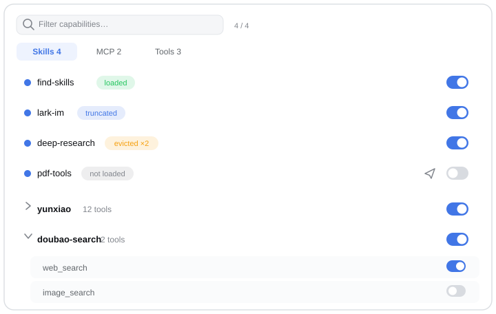

# dsh-capability-panel

English | [中文](README.zh.md) | [日本語](README.ja.md) | [한국어](README.ko.md)

**See what your DeepSeek Harness agent can actually reach right now — and switch it, per session or per preset.**

A panel for the live conversation's capability surface: every skill, MCP server, and system tool, with its real in-context state and a switch that takes effect on the very next model step.



---

## At a glance (agent quick reference)

| | |
|---|---|
| What | A [DeepSeek Harness](https://github.com/deepseek-ai/deepseek-harness) (`dsh`) web plugin: a panel that lists the live session's skills, MCP servers, and system tools with their true in-context state, plus switches to toggle them |
| Use it to | answer "why doesn't the agent know this skill"; see whether a loaded skill survived pruning/compaction; turn a tool or MCP server off for one session only; set per-preset default capabilities; count blocked tool calls after a disable |
| Install | `dsh plugin --profile web add dsh-capability-panel` (then restart dsh) |
| Requires | dsh web profile, dsh ≥ 0.1.2-rc.1; all `@deepseek-ai/*` peers provided by the host |
| Data | `$DSH_HOME/settings.yaml` namespace `capability-panel`; stats at `$DSH_HOME/capability-panel/stats.jsonl`; loopback API `/api/capability-panel` |
| Package | `dsh-capability-panel` on npm; bundle id `capability-panel` |

## Why

A skill being *installed* and a skill being *in the model's context right now* are two different facts — and only the second one answers "why doesn't my agent know this?" Between them sits context management: the tool-result pruner truncates long payloads, and compaction replaces whole spans of history with a summary. A skill you watched load five minutes ago may be partially or fully gone from the model's view, while its load record sits in the durable log forever, pretending otherwise.

And sometimes you simply want the model to stop reaching for one tool in one conversation — not uninstall a plugin, not edit a config file and restart. Just this session, from the next step on.

This plugin turns both into one panel at the right of the composer.

## Features

- **Ground-truth load states.** Every skill reports what the model actually sees on the next request: `loaded` (full instructions in context), `truncated` (the pruner kept head & tail, cut the middle), `evicted` (compaction took it entirely), or `not loaded` — plus a cumulative load count, so a skill reloaded after eviction reads `loaded ×2`.
- **Per-session switches that survive restarts.** Turn a skill, tool, or whole MCP server off for the current conversation. The switch applies from the next prompt assembly, stays bound to that session across a dsh restart, and never touches another session or the conversation history.
- **Preset defaults.** Settings → Capability Panel stores the default capability set per agent preset; sessions created or resumed afterward inherit it. Same filter, same grouping, same switches as the session panel — a preset default is a starting point the session can still override.
- **MCP grouped by server.** Two hundred tools behind two servers stay scannable: collapse to one row per server, flip the whole server in one write.
- **Blocked-attempt counts.** If the model still calls a capability after you turned it off, the panel counts it — the signal that the model is acting from memory and the switch needs a louder story.
- **One-click command fill.** A skill row's paper-plane button drops `/skill-name` into the composer, ready for your Enter.
- **Fast filtering.** Match on name, description, or the visible state pill ("truncated" / "已截断" both work), with matching descriptions auto-expanded.
- **Lightweight.** Zero runtime dependencies, zero-copy reads, no background work — the panel only reads when open.
- **Follows the UI language.** Panel copy switches between 中文 and English with the host.

## Production-grade by default

- **Thoroughly tested**: 390+ tests with typecheck, type-aware lint, and 100% coverage gates (statements/branches/functions/lines) enforced in CI on every push and PR.
- **Honest failures**: when any one read fails (skill registry, session view, settings store), the panel shows partial data plus an explicit degraded note — a read failure never masquerades as an empty list.
- **Race-free writes**: preset defaults and session switches share one serialized write queue, so two panels writing at once cannot clobber each other.
- **Never a drag on the host**: the agent-created listener is fully failure-isolated — no plugin error can stop your session from starting.
- **i18n-friendly**: panel copy follows the host's UI language (中文/English), and the docs are kept section-aligned across four languages.

## Install

From the marketplace or straight from the repo:

```bash
dsh plugin --profile web add dsh-capability-panel
# or
dsh plugin --profile web add github:pure-craft/dsh-capability-panel
```

Restart dsh for the install to take effect.

Requires a DeepSeek Harness web profile (`dsh web`). All `@deepseek-ai/*` runtime pieces are provided by the host as peer dependencies — there is nothing else to install.

## Usage

Open any conversation and click the context icon at the right of the composer; the panel opens upward.

- Three tabs across the top: **Skills N** / **MCP N** / **Tools N**, each with its live count
- The switch at the right of each row takes effect immediately — no refresh, no restart
- Click the row itself to expand its description
- The filter box at the top matches name, description, or state label, with an `X / Y` matched count
- A disabled row renders dimmed, and the model is told in its system prompt that you turned the capability off

`run_code` is the reserved Code Mode transport — the registry forbids masking it, so its switch is locked on.

Two scopes, same switches: **the composer panel** is bound to the session in front of you (and restored with it after a restart); **Settings → Capability Panel** decides what every later session starts from. Preset defaults are read when a session agent is created — they do not rewrite preset files and do not change agents that are already running.

## How it works

**Lightweight by construction.** The plugin ships zero runtime dependencies — React, the UI primitives, and every `@deepseek-ai/*` piece are provided by the host — and its reads are zero-copy: load states come from the live session's in-memory surface (what the model will see next), never re-folded from the durable log, so opening the panel costs a scan of references, not a parse of history.

Switches are thin overlays on the next prompt assembly — a same-name shadow for skills, a registry mask for tools — plus a per-assembly note telling the model what you turned off. Session toggles persist under the session's own id in the plugin's settings namespace, so a restored session gets exactly its own switches back, and nothing ever writes to the conversation log.

## Where data lives

- Preset defaults and session-bound switch positions: the `capability-panel` namespace in `$DSH_HOME/settings.yaml` (session switches under `sessions.<sessionId>`, kept for up to 200 sessions, oldest evicted first). The harness never drops a section whose plugin is not loaded, so uninstalling keeps these until you delete the section.
- Blocked-attempt stats: `$DSH_HOME/capability-panel/stats.jsonl`, readable directly at `curl 'http://127.0.0.1:3080/api/capability-panel/stats'`.

The data route accepts loopback callers only, keyed on the connection's peer address.

## Development

```bash
pnpm install
pnpm dev        # watch build
pnpm build      # build both the host and client halves
pnpm test       # run the tests
pnpm typecheck  # typecheck
pnpm lint       # oxlint, including its type-aware rules
pnpm check      # typecheck + lint + test (100% coverage gates)
```

A change to the host half needs a dsh restart; the client half hot-swaps while `dsh web` and the watch build run together.

## License

[MIT](LICENSE)
