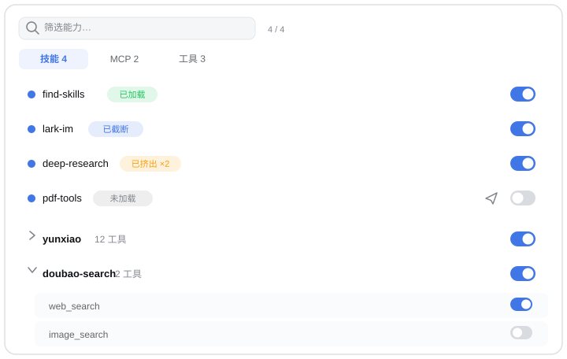

# dsh-capability-panel

[English](README.md) | 中文 | [日本語](README.ja.md) | [한국어](README.ko.md)

**看清你的 DeepSeek Harness agent 此刻真正能触达什么——并且随时开关，按会话或按 preset。**

一个面向当前对话能力面的面板：每个技能、每个 MCP 服务器、每个系统工具，都有真实的"在不在上下文里"状态，和一个从下一步模型调用就生效的开关。



---

## 速查(agent 快速参考)

| | |
|---|---|
| 是什么 | [DeepSeek Harness](https://github.com/deepseek-ai/deepseek-harness)(`dsh`)的 web 插件:一个面板,列出当前会话的技能、MCP 服务器、系统工具及其真实的在不在上下文状态,并能逐项开关 |
| 什么时候用 | 回答"为什么 agent 不知道这个技能";看一个加载过的技能是否挺过了剪枝/压缩;只在当前会话里关掉某个工具或 MCP 服务器;为 preset 设置默认能力集合;统计关闭后被拦截的调用次数 |
| 安装 | `dsh plugin --profile web add dsh-capability-panel`(然后重启 dsh) |
| 要求 | dsh web profile,dsh ≥ 0.1.2-rc.1;`@deepseek-ai/*` peer 全部由宿主提供 |
| 数据 | `$DSH_HOME/settings.yaml` 的 `capability-panel` 命名空间;统计在 `$DSH_HOME/capability-panel/stats.jsonl`;loopback API `/api/capability-panel` |
| 包 | npm 上的 `dsh-capability-panel`;bundle id `capability-panel` |

## 为什么

技能"装好了"和技能"此刻在模型的上下文里"是两件事——而只有后者能回答"为什么 agent 不知道这个"。两者之间隔着上下文管理：工具结果剪枝器会截断过长的返回，压缩会把整段历史换成一条摘要。你眼看着五分钟前加载过的技能，可能已经部分或全部离开了模型的视野，而它的加载记录还永久躺在日志里，假装一切如常。

有时你也只是想让模型在这一个对话里别再碰某个工具——不是卸载插件，不是改配置文件重启，就只是这一个会话、从下一步开始。

这个插件把这两件事变成输入框右侧的一个面板。

## 功能

- **真实的加载状态。** 每个技能报告的是模型在下一次请求里实际能看到什么：`已加载`（完整指令在上下文里）/ `已截断`（剪枝器留下首尾、挖掉中间）/ `已挤出`（被压缩整体吞掉）/ `未加载`——外加累计加载次数，被挤出后重新加载的技能读作"已加载 ×2"。
- **重启不丢的会话级开关。** 关掉当前会话里的一个技能、一个工具或一整个 MCP 服务器：从下一次提示组装生效，重启 dsh 后随该会话恢复，且绝不碰其他会话、绝不动对话历史。
- **Preset 默认。** 设置 → 能力面板，为每个 agent preset 存一份默认能力集合；之后新建或恢复的会话继承它。与会话面板同一套筛选、分组和开关——preset 默认只是起点，会话里仍然可以覆盖。
- **MCP 按服务器分组。** 两个服务器挂着两百个工具也能扫得过来：折叠成每服务器一行，一次开关整组。
- **拦截计数。** 模型在你关掉某项之后仍然尝试调用，面板会计数——这是"模型在凭记忆行动、开关需要更响亮的告知"的信号。
- **一键填入命令。** 技能行上的纸飞机按钮把 `/skill-name` 放进输入框，等你自己的回车。
- **快速筛选。** 按名称、描述或状态文案匹配（搜"已截断"或"truncated"都可以），命中时描述自动展开。
- **轻量。** 零运行时依赖、零拷贝读取、无后台工作——面板只在打开时读一次。
- **跟随界面语言。** 面板文案随宿主在中英文之间切换。

## 工程品质

- **测试完备**:390+ 测试,typecheck + 类型感知 lint + 100% 覆盖率门槛(语句/分支/函数/行)在 CI 上对每次 push 和 PR 强制执行。
- **失败诚实**:任何一环读不到(技能注册表、会话视图、设置存储),面板显示部分数据加明确的降级提示——绝不把"读失败"伪装成"列表为空"。
- **写入不竞态**:preset 默认和会话开关共享一条串行写队列,两个面板同时写也互不覆盖。
- **不拖累宿主**:agent 创建监听做了完整的失败隔离——插件的任何异常都不会阻止你的会话启动。
- **本地优先，零网络**:数据路由只接受 loopback,插件没有外呼、没有遥测、没有第三方服务——所有状态只留在本机的 settings.yaml 和一个 JSONL 里。
- **长会话依然秒开**:6 万事件、几十 MB 日志的会话上,面板即点即开:零拷贝 surface 直读,打开时才读一次,没有轮询和后台任务。
- **历史保留式开关**:开关永不改写对话历史——被关掉的能力在日志里原样保留,"已关闭"告知在每次组装时现算。每个开关都是可后悔的决定,不是不可逆的手术。
- **只走官方扩展点**:全部能力来自 dsh 的正式接缝(`tools.restrict`、`system-prompt/assemble`、settings 命名空间、UI slots),没有猴子补丁,宿主升级时更不容易碎。
- **主题免费**:颜色全部走宿主 design token,图标用宿主图标库——浅色/深色、语言切换都自动跟随,不需要自己维护主题。
- **国际化友好**:面板文案跟随宿主界面语言(中/英),文档四种语言逐节对齐。

## 安装

从插件市场，或直接从仓库安装：

```bash
dsh plugin --profile web add dsh-capability-panel
# 或
dsh plugin --profile web add github:pure-craft/dsh-capability-panel
```

安装后需要重启 dsh 才生效。

要求 DeepSeek Harness 的 web profile(`dsh web`),dsh ≥ 0.1.2-rc.1。所有 `@deepseek-ai/*` 运行时件都由宿主以 peer 依赖形式提供——没有别的要装。

## 使用

打开任意对话，点输入框右侧的上下文图标，面板向上展开。

- 顶部三个分区：**技能 N** / **MCP N** / **工具 N**，各带实时计数
- 每行右侧的开关立即生效——不刷新、不重启
- 点击行本身展开描述
- 顶部筛选框匹配名称、描述或状态文案，下方有 `X / Y` 命中计数
- 被关闭的行变暗，同时模型的系统提示里会被告知"用户关闭了这些能力"

`run_code` 是保留的 Code Mode 传输通道——注册表禁止遮罩它，所以它的开关锁定为开。

两个作用域，同一组开关：**输入框里的面板**绑定你眼前的会话（重启后随它恢复）;**设置 → 能力面板**决定之后每个会话从什么状态开始。Preset 默认在会话 agent 创建时读取——不改写 preset 文件，也不改变已经在运行的 agent。

## 工作原理

**生而轻量。** 插件零运行时依赖——React、UI 组件和全部 `@deepseek-ai/*` 都由宿主提供——读取也是零拷贝:加载状态来自 live session 的内存 surface(模型下一次将看到的内容),从不对持久日志重新折叠,打开面板的代价是一次引用扫描,而不是解析历史。

开关是下一次提示组装上的薄覆盖层——技能用同名影子、工具用注册表遮罩——外加一条组装时现算的"你关了什么"的告知。会话开关以会话自己的 id 持久化在插件设置命名空间里,恢复的会话恰好拿回自己的开关,对话日志永不被写入。

## 数据存放

- Preset 默认值与会话绑定的开关位置：`$DSH_HOME/settings.yaml` 的 `capability-panel` 命名空间（会话开关在 `sessions.<sessionId>` 下，最多保留 200 个会话、最旧的先淘汰）。宿主从不丢弃未加载插件的分节，所以卸载后它们还在，直到你手动删除该段。
- 拦截统计：`$DSH_HOME/capability-panel/stats.jsonl`，可直接读取：`curl 'http://127.0.0.1:3080/api/capability-panel/stats'`。

数据路由只接受 loopback 请求，判定依据是连接对端地址。

## 开发

```bash
pnpm install
pnpm dev        # watch 构建
pnpm build      # 构建 host 与 client 两半
pnpm test       # 跑测试
pnpm typecheck  # 类型检查
pnpm lint       # oxlint(含 type-aware 规则)
pnpm check      # typecheck + lint + test(100% 覆盖率门槛)
```

改动 host 半需要重启 dsh;client 半在 `dsh web` 与 watch 构建同时运行时热替换。

## 许可证

[MIT](LICENSE)
